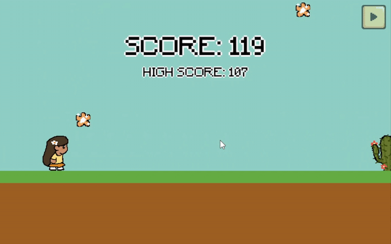

# ⋆˙⟡Lily Wants to Run⟡˙⋆

<p align="center">
  
</p>

**Lily Wants to Run** is a 2D side-scrolling platformer game developed in Python using Pygame.

Join Lily on her endless journey through colorful levels filled with obstacles and challenges, and help her run away!! ^_^ ── .✦

*NOTE: Only 1 level is available as of now*

*NOTE: Music adjustment is not fully developed yet!*

---

## Gameplay Overview ⋆˙⟡

- You control **Lily**, a fast and nimble character who never stops running.
- Dodge obstacles, jump across platforms, and try to survive as long as you can.
- Collect sparkly flowers! ⋆˚✿˖°

---

## Features ⋆˙⟡

- Sound effects & background music
- Game over screen + high score tracker
- Main menu, pause/resume options 
- Polish UI/UX and animations (made from scratch!)
- Smooth and responsive controls    
- Custom pixel-art assets (created by me!)
- Modular code design (`main.py`, asset management folders)

---

## Upcoming Features ⋆˙⟡
  
- Power-ups & collectibles  
- Multiple unique enemies
- Multiple environments & dynamic level generation  
- Level-based progression system (50+ levels!)
- Game volume adjustment
- Game start screen design
- A proper how to play menu
- A better background design
- Game save-load feature

---

## Tech Stack ⋆˙⟡

- **Language:** Python 3.10+  
- **Library:** Pygame  
- **Assets:** Custom-made sprites and tiles, copyright-free music  
- **Structure:** Modular folders for assets, levels, and game logic

---

## Getting Started ⋆˙⟡

### 1. Clone the repository:

```bash
git clone https://github.com/yourusername/lily-wants-to-run.git
cd lily-wants-to-run 
```

### 2. Install dependencies:

```bash
git clone https://github.com/yourusername/lily-wants-to-run.git
cd lily-wants-to-run
```

### 3. Run the game:

```bash
python main.py
```

---

## Contributing ⋆˙⟡
All forms of constructive feedback, feature suggestions, and code contributions are welcome!

If you’d like to help improve the game, feel free to:

- Fork the repo

- Make your changes

- Open a pull request

---

## Feedback ⋆˙⟡
I'm always open to helpful criticism and suggestions. Feel free to open an **Issue** or message me directly.

₊˚⊹♡ Let’s make **Lily Wants to Run** even better together! ♡⊹˚₊

---

## --License--
This project is open source under the MIT License.

<h1 align="center">== ⋅˚₊‧ ୨୧ ‧₊˚⋅ ==</h1>
